# Taekus Demo

A fintech card management demo app built with React Native, Expo, TypeScript, RTK Query, and Redux Toolkit.

## Screenshots

### Light Mode

| Login | Home | Card Detail |
|---|---|---|
| 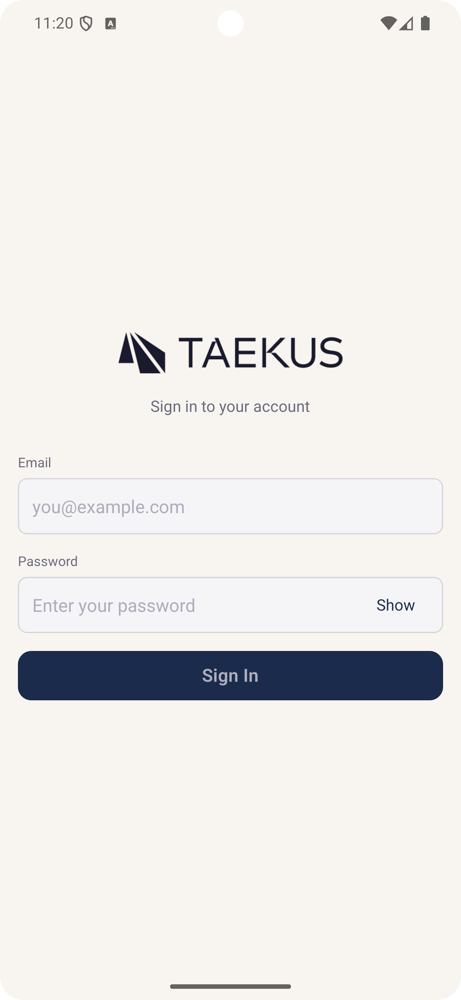 | 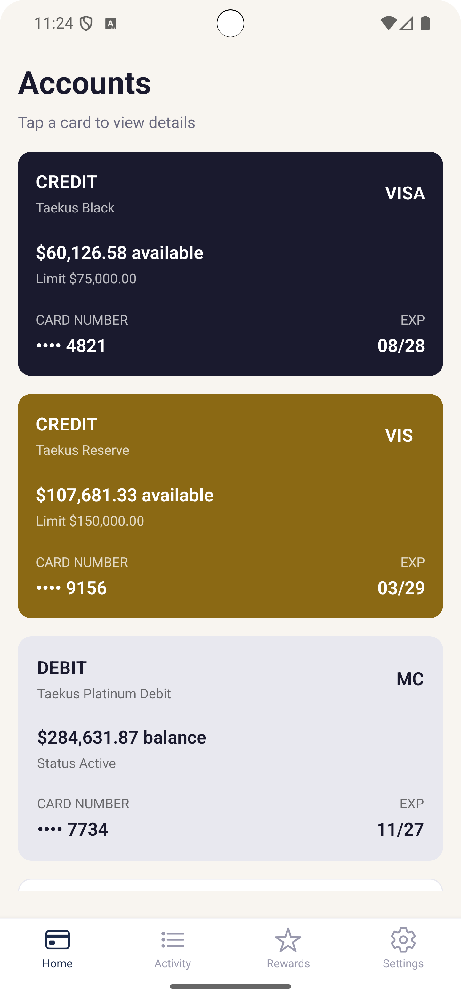 | 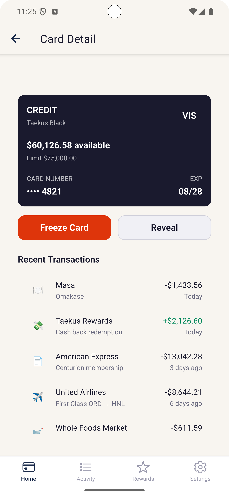 |

| Activity | Transaction | Settings |
|---|---|---|
| 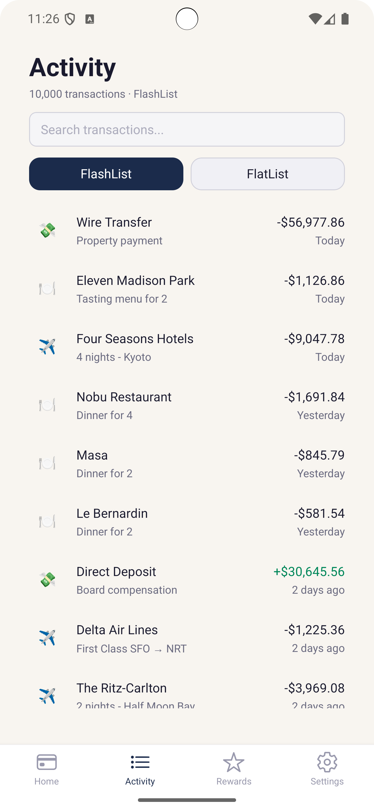 | 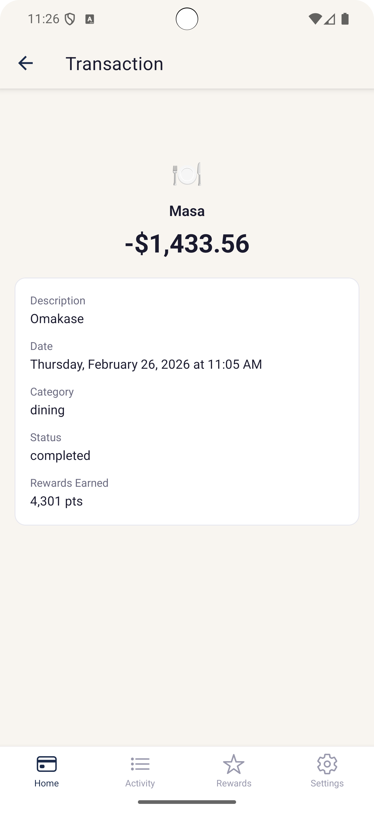 | 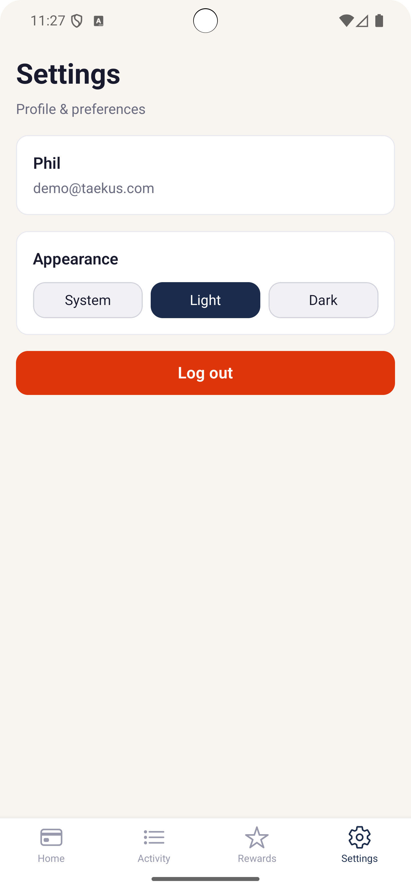 |

### Dark Mode

| Login | Home | Card Detail |
|---|---|---|
| 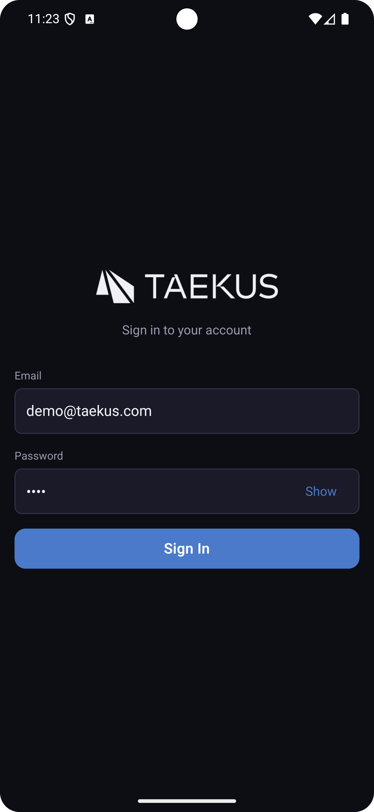 | 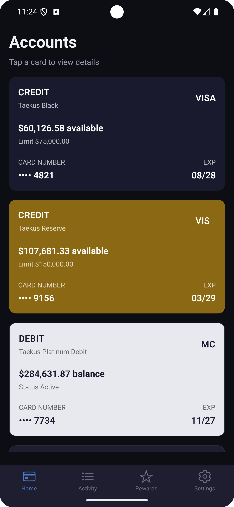 | 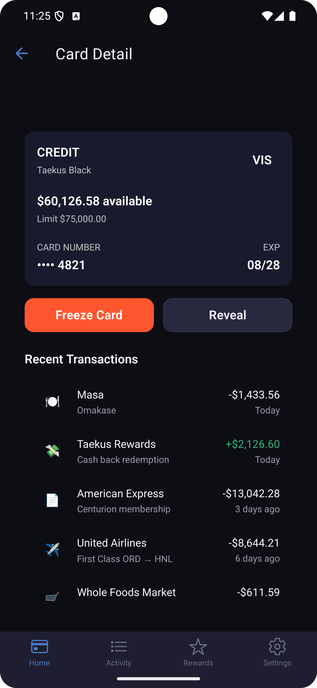 |

| Activity | Transaction | Settings |
|---|---|---|
| 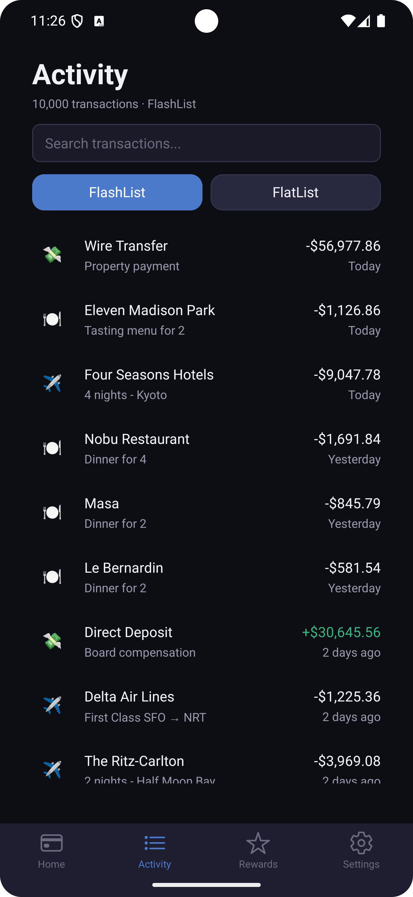 | 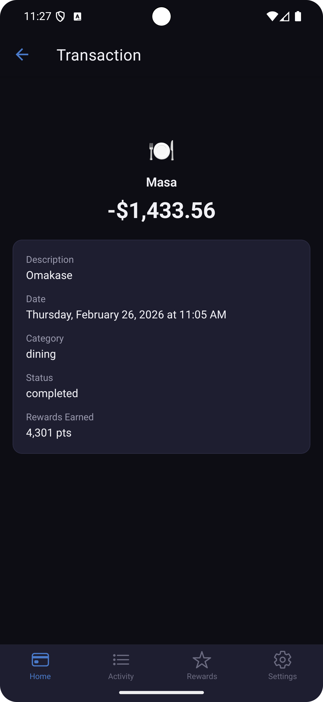 | 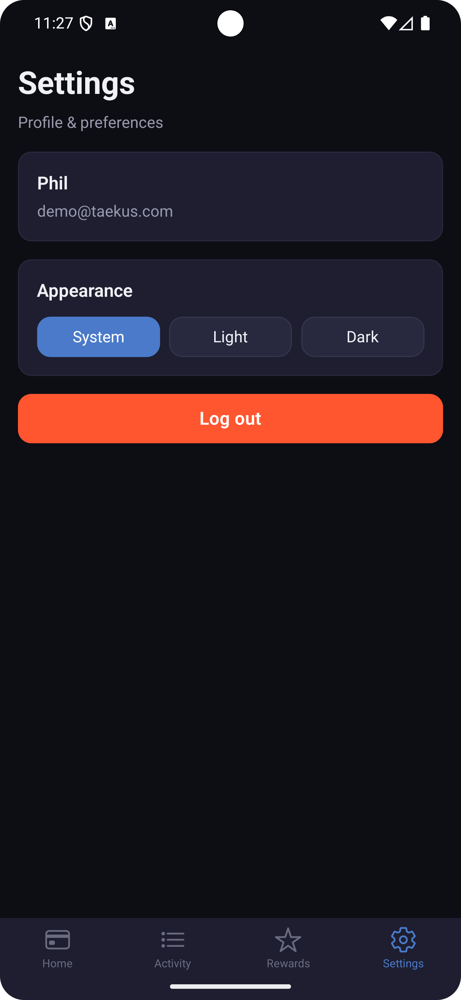 |

## Tech Stack

- React Native + Expo (managed workflow)
- TypeScript
- Redux Toolkit + RTK Query
- React Navigation (bottom tabs + nested stacks)
- React Native Reanimated
- @shopify/flash-list
- expo-local-authentication, expo-haptics, expo-secure-store

## Architecture

- Feature-based directory structure
- Three-layer state management: RTK Query (server), Redux slice (auth), local state (UI)
- Custom data hooks separating business logic from UI
- Theme system with light/dark/system support
- Shared component library with accessibility defaults